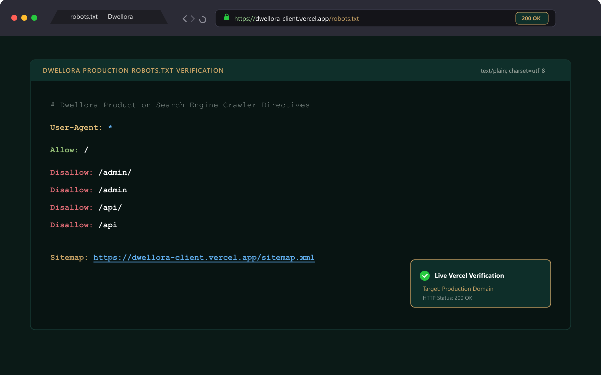
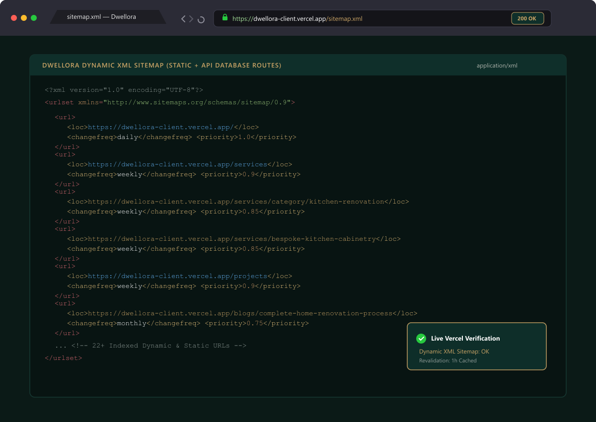

# Dwellora - Premium Home Renovation Website

> **Frontend Developer Task Assessment**  
> **Company**: [Digital Resolution](https://digitalresolution.net/)  
> **Email**: contact@digitalresolution.net  
> **Address**: Software Technology Park, 6th Floor, Singapore Bangkok Market, Agrabad, Chattogram.  
> **Live Production Demo**: [https://dwellora-client.vercel.app](https://dwellora-client.vercel.app)  
> **Reference Inspiration**: [Tangs Carpentry](https://tangscarpentrysg.com/)

---

## Project Overview

**Dwellora** is a modern, responsive home renovation and custom carpentry business web platform designed for a high-end architectural studio. Built with a focus on luxury UI/UX aesthetics, dynamic content management, and robust engineering, the platform delivers:

- A **modern responsive frontend** that showcases architectural craftsmanship, whole-home transformation workflows, bespoke joinery services, portfolio galleries, and editorial vlogs.
- **Dynamic content management** backed by a REST API and MongoDB database, allowing live updates to services, categories, case studies, and multimedia blogs without rebuilding the frontend.
- An intuitive **Admin Dashboard** providing secure administrative controls over all published site content.

---

## Technology Stack

### Frontend
- **Framework**: Next.js (App Router, Turbopack, React 19)
- **Language**: TypeScript
- **Styling**: Tailwind CSS (Tailored dark forest green `#0F2F2A`, warm gold `#c9a365`, off-white `#faf6ef`)
- **Animation**: Framer Motion
- **Icons**: React Icons (Feather & FontAwesome)
- **Optimization**: Next/Image & dynamic metadata

### Backend
- **Runtime**: Node.js
- **Framework**: Express.js
- **Language**: TypeScript
- **Database**: MongoDB (Native driver & aggregation pipelines)
- **Architecture**: REST API

---

## Features Implemented

### Public Website
- **Home Page**: High-contrast architectural hero, trust metrics, service categories showcase, value highlights, featured projects gallery, whole-home renovation vlog showcase, renovation process steps, blog feed, interactive expandable FAQ section, cinematic kitchen showcase CTA, and dynamic luxury footer.
- **About Section**: Studio history, craftsmanship philosophy, and team presentation.
- **Services Listing**: Filterable directory of renovation disciplines and carpentry specialties.
- **Service Details**: Dynamic slug-based pages (`/services/[slug]`) with deliverables, dynamic category taxonomy (`/services/category/[categorySlug]`), and related service suggestions.
- **Projects / Portfolio Showcase**: Dynamic project galleries (`/projects/[slug]`) with before/after case studies and material specifications.
- **Blog / Vlog Section**: Rich multimedia article feed supporting both text-based editorials and embedded video walkthroughs.
- **Contact Section**: Interactive consultation inquiry form with validation.
- **Responsive Luxury UI Design**: Mobile-first architecture with smooth transitions, zero layout shift, and fluid typography across all viewports.
- **Custom 404 Page**: Architectural blueprint error page with navigation shortcuts.

### Admin Dashboard
- **Admin Authentication**: Secure JWT-based administrative access control.
- **Service CRUD**: Create, edit, delete, and re-order services and categories.
- **Blog / Vlog CRUD**: Create, update, and manage editorial articles and video vlog showcases.
- **Project CRUD**: Create and manage completed renovation portfolios and image galleries.
- **Publish / Unpublish Management**: Real-time status toggling for live content visibility.
- **Dynamic Data Updates**: All administrative modifications instantly reflect across public pages and sitemaps.

### SEO Implementation
- **Root Metadata**: Configured title template (`%s | Dwellora`), brand description, keywords, and author tags.
- **Dynamic Metadata**: Automated `generateMetadata()` hooks for services, projects, and blogs/vlogs.
- **Open Graph & Twitter Cards**: High-resolution image previews and structured metadata for social sharing.
- **Canonical URLs & SEO Friendly Slugs**: Clean, readable, and search-optimized URL structures.
- **Dynamic XML Sitemap (`/sitemap.xml`)**: Automated indexing of static and database-driven routes with change frequencies and priority ratings.
- **Robots Directives (`/robots.txt`)**: Crawler rules allowing public indexing while disallowing `/admin/` and `/api/` endpoints.
- **Google Search Console Verification**: Verification meta tag embedded in root metadata.
- **Image Optimization**: Title-based descriptive alt tags and responsive format delivery.

---

## Project Structure

```text
Dwellora/
├── Dwellora-client/              # Next.js App Router Frontend
│   ├── public/                   # Static branding logos, icons, and media
│   ├── src/
│   │   ├── app/                  # App Router routes, layouts, and handlers
│   │   │   ├── about/            # About page
│   │   │   ├── admin/            # Admin dashboard and authentication
│   │   │   ├── blogs/            # Blog/vlog directory and [slug] pages
│   │   │   ├── contact/          # Consultation booking page
│   │   │   ├── projects/         # Portfolio and [slug] pages
│   │   │   ├── services/         # Services directory, [slug], and categories
│   │   │   ├── globals.css       # Global design system styles
│   │   │   ├── layout.tsx        # Root layout with SEO & JSON-LD schema
│   │   │   ├── not-found.tsx     # Custom 404 page
│   │   │   ├── robots.ts         # Dynamic robots.txt
│   │   │   └── sitemap.ts        # Dynamic sitemap.xml
│   │   ├── components/           # UI components, cards, navigation, and footer
│   │   ├── lib/                  # Shared utilities and API helper functions
│   │   └── types/                # Global TypeScript type definitions
│   └── docs/                     # Documentation and verification screenshots
│
└── dwellora-server/              # Express.js REST API Backend
    ├── src/
    │   ├── config/               # Database connection and environment config
    │   ├── controllers/          # Business logic handlers for CRUD endpoints
    │   ├── middleware/           # Auth guards, error handling, validation
    │   ├── models/               # MongoDB collections and schema definitions
    │   ├── routes/               # API routes (/api/services, /api/blogs, etc.)
    │   ├── seed/                 # Database seed datasets
    │   └── server.ts             # Server entry point
    └── package.json
```

---

## Local Setup Instructions

### Frontend Setup

```bash
cd Dwellora-client
npm install
npm run dev
```

> **Environment Configuration**:  
> Create a `.env.local` file in `Dwellora-client/` based on `.env.example`.

---

### Backend Setup

```bash
cd dwellora-server
npm install
npm run dev
```

> **Environment Configuration**:  
> Create a `.env` file in `dwellora-server/` based on `.env.example`.

---

## Deployment

- **Frontend (Live Production)**: [https://dwellora-client.vercel.app](https://dwellora-client.vercel.app)
- **Backend**: Hosted on cloud infrastructure (e.g. Render / Railway / Custom VPS)

---

## Admin Access

- **Admin Login Portal**: [https://dwellora-client.vercel.app/admin/login](https://dwellora-client.vercel.app/admin/login)
- **Email**: *(Provided separately for assessment evaluation)*
- **Password**: *(Provided separately for assessment evaluation)*

---

## SEO Verification Proof

### Robots.txt
Live URL: [https://dwellora-client.vercel.app/robots.txt](https://dwellora-client.vercel.app/robots.txt)



### Sitemap.xml
Live URL: [https://dwellora-client.vercel.app/sitemap.xml](https://dwellora-client.vercel.app/sitemap.xml)


